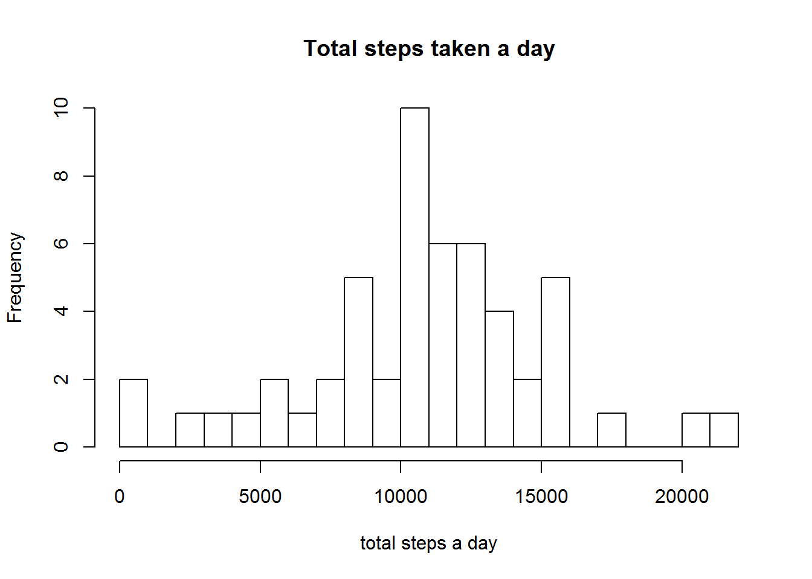
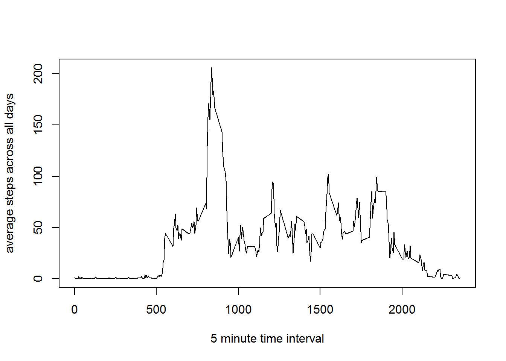
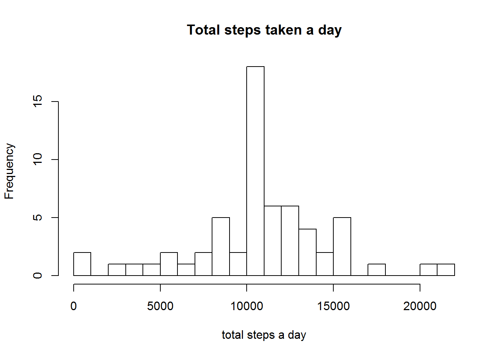
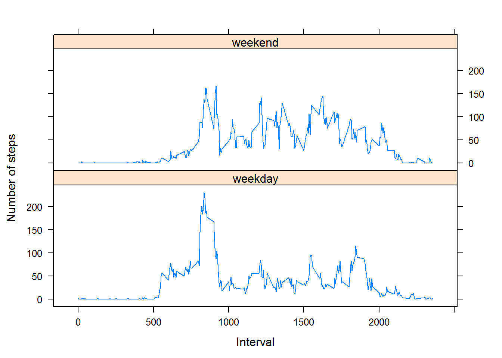

# Reproducible Research: Peer Assessment 1
In this research we would like to answer if there is a behavior in steps taken.
We will look at this from a total number of steps a day, 
an average daily pattern 
and a difference in day patterns on weekdays or weekends. 

## Loading and preprocessing the data
The data is from
https://d396qusza40orc.cloudfront.net/repdata%2Fdata%2Factivity.zip
and has been included in the repository I forked from: 
http://github.com/rdpeng/RepData_PeerAssessment1.
I used commit 80edf39c3bb508fee88e3394542f967dd3fd3270 from Oct 22 2014.  

The data consists of two months of data from an anonymous individual
collected during the months of October and November, 2012 and include
the number of steps taken in 5 minute intervals each day.

### Extract the data file
The data file activity.csv will be exracted from the zip file if it does not
already exist. The following code will download the zip file if it did not yet
exist in the context. If the activity.csv file already exists this will not do
anything, assuming this is the right version of the file now.


```r
if (!file.exists("activity.csv")){
    if (!file.exists("activity.zip")){
        download.file("https://d396qusza40orc.cloudfront.net/repdata%2Fdata%2Factivity.zip",
                      "activity.zip",
                      mode="wb")
    }
    # unzip the contents of the zip to working folder
    unzip("activity.zip", exdir=".")
}
```

### load data into a data frame
The data has a , separated format, uses " for character data and NA for null
data. The following will read all data and place this in the steps data.frame.

```r
steps <- read.csv("activity.csv", stringsAsFactors=FALSE, na.strings=c("NA"))
```

### Process/transform the data
Clean empty values

```r
complete <- steps[complete.cases(steps),]
```

The steps list has a textual date, where we're interested in days, 
and weekdays or weekends. I'll update the data column to have the Posix date

```r
library(lubridate)
steps$datetime <- ymd(steps$date) + hours(floor(steps$interval/100)) + minutes(steps$interval%%100)
```

Then I'll add a column for a factor weekday/weekend

## What is mean total number of steps taken per day?
For this part of the assignment, you can ignore the missing values in
the dataset.

1. Make a histogram of the total number of steps taken each day

```r
day_steps<-split(complete$steps, complete$date) #split on days, group intervals
sum_day_steps<-lapply(day_steps,sum) # sum values per day
hist(as.numeric(sum_day_steps), breaks=16, xlab="total steps a day", main="Total steps taken a day")
```

 

2. Calculate and report the **mean** and **median** total number of steps taken per day


```r
mean(as.numeric(sum_day_steps))
```

```
## [1] 10766.19
```


```r
median(as.numeric(sum_day_steps))
```

```
## [1] 10765
```

## What is the average daily activity pattern?
We need to see a time series plot to evaluate the total number of steps 
taken each day, including an average number of steps taken across all days

Make a time series plot (i.e.  type = "l" ) of the 5-minute interval (x-axis) and the average number of steps taken, averaged across all days (y-axis)

```r
timeslots<-split(complete$steps, complete$interval) #split on timeslots, group days
average<-sapply(timeslots,mean) # average out all day values
plot(names(average), average, type="l", xlab="5 minute time interval", ylab="average steps across all days") #plot the average across all days
```

 

2. Which 5-minute interval, on average across all the days in the dataset, contains the maximum number of steps?

```r
names(average[average == max(average)])
```

```
## [1] "835"
```


## Imputing missing values
Note that there are a number of days/intervals where there are missing
values (coded as `NA`). The presence of missing days may introduce
bias into some calculations or summaries of the data.

1. Calculate and report the total number of missing values in the dataset (i.e. the total number of rows with `NA`s)

```r
sum(is.na(steps$steps))
```

```
## [1] 2304
```

2. Devise a strategy for filling in all of the missing values in the dataset. The strategy does not need to be sophisticated. For example, you could use the mean/median for that day, or the mean for that 5-minute interval, etc.

I'd be filling the missing data with **mean** value of the other days for the same time interval.

3. Create a new dataset that is equal to the original dataset but with the missing data filled in.

```r
filled <- steps
filled$steps[is.na(filled$steps)] <- average[as.character(filled$interval[is.na(filled$steps)])]
```

4. Make a histogram of the total number of steps taken each day and Calculate and report the **mean** and **median** total number of steps taken per day. Do these values differ from the estimates from the first part of the assignment? What is the impact of imputing missing data on the estimates of the total daily number of steps?

```r
day_steps_filled<-split(filled$steps, filled$date) #split on days, group intervals
sum_day_steps_filled<-lapply(day_steps_filled,sum) # sum values per day
hist(as.numeric(sum_day_steps_filled), breaks=16, xlab="total steps a day", main="Total steps taken a day")
```

 


```r
mean(as.numeric(sum_day_steps_filled))
```

```
## [1] 10766.19
```


```r
median(as.numeric(sum_day_steps_filled))
```

```
## [1] 10766.19
```

### Changes
As expected the mean stays the same, the median is a bit higher, also as expected as I ignored a few values before, I did not expect it to be the same as the mean.The histogram shows a little higher frequencies, which was to be expected as there are more valid values now.


## Are there differences in activity patterns between weekdays and weekends?
For this part the `weekdays()` function may be of some help here. Use
the dataset with the filled-in missing values for this part.

1. Create a new factor variable in the dataset with two levels -- "weekday" and "weekend"
indicating whether a given date is a weekday or weekend day.

```r
filled$weekpart <-factor(ifelse(weekdays(ymd(filled$date)) == "Saturday" | weekdays(ymd(filled$date)) == "Sunday",
                                "weekend",
                                "weekday"))
```

1. Make a panel plot containing a time series plot (i.e. `type = "l"`) of the 5-minute interval (x-axis) and the average number of steps taken, averaged across all weekday days or weekend days (y-axis).:

```r
filled_weekend <- filled[filled$weekpart=="weekend",1:3] #section of weekend days
filled_weekdays <- filled[filled$weekpart=="weekday",1:3] #section of weekend days

filled_weekend_timeslots <- split(filled_weekend$steps, filled_weekend$interval) #split on timeslots, group days
filled_weekdays_timeslots <- split(filled_weekdays$steps, filled_weekdays$interval) #split on timeslots, group days

filled_weekend_average <- sapply(filled_weekend_timeslots, mean) # average out all day values
filled_weekdays_average <- sapply(filled_weekdays_timeslots, mean) # average out all day values

par(mfrow = c(2, 1), mar = c(4, 4, 2, 1), oma = c(0, 0, 2, 0))
plot(names(filled_weekend_average), filled_weekend_average, type="l", xlab="", ylab="", main = "weekend") #plot the average weekend 
plot(names(filled_weekdays_average), filled_weekdays_average, type="l", xlab="", ylab="", main = "weekday") #plot the average weekday
```

 
